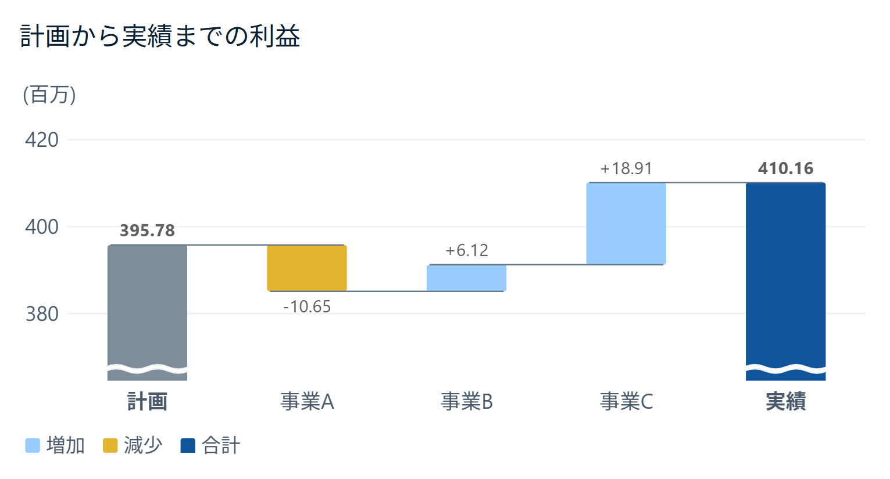
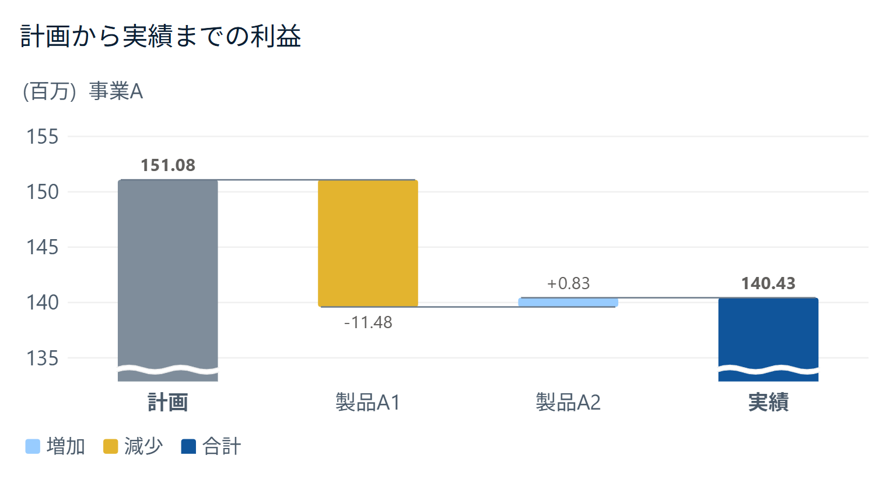

# ウォーターフォール by itoken lab（Power BI カスタムビジュアル）

「ウォーターフォール by itoken lab」は、Power BI のカスタムビジュアルのウォーターフォールです。標準のウォーターフォールと同じように使えるようにしたうえで、標準では届かないところを足しています。

最初に足したのは、計画から実績までの差を階層でたどれることです。標準のウォーターフォールは「詳細」に 1 つのフィールドしか入らないので、差を 1 段にしか分けられません。このビジュアルは「カテゴリ」に階層を入れて、事業 > 製品 > 科目 > 明細とドリルダウンできます。ドリルダウンした先では、両端がその親の計画と実績になります。





## 標準のウォーターフォールとの違い

### 足したもの

- **階層でドリルダウン**できます。「カテゴリ」に複数のフィールドを入れ、右クリックの「ドリルダウン」で下の階層へ。両端の合計は、そのとき見えている範囲（親）の値になります。今いる位置（「事業A ＞ 製品A1」など）をグラフの左上に出します（「ウォーターフォール」カードの「ドリルの位置」で消せます）。
- **両端に計画と実績を置けます**。「比較」に計画・実績を分ける列を入れるか、「値」に計画・実績のメジャーを順に入れます。3 つ以上（計画・見通し・実績）なら、両端だけをつなぐか、すべてを順につなぐかを選べます。左端・右端にする値も選べます。
- **段階の小計**を挟めます。「小計」に、行ごとの段階の名前を持つ列（売上総利益・営業利益など）を入れると、その区切りの最後に小計の棒が立ちます。比べる形では、計画からその段階までの差の棒を出します（棒の名前は段階の名前、値は符号付き）。見せ方は、枠だけ・透かす・斜線・点線の枠から選べます。
- **起点**から積む形も描けます。「起点」に期首の残高や投入数を入れると、起点 → 増減 → 期末の形になります。
- **凡例で積む**：「凡例」に列を入れると、1 本の増減を凡例の値の色で積みます（正の区画は上へ、負の区画は下へ）。
- **目標の線**：「目標」にメジャーを入れると、目標の値に線を引きます。名前は凡例に出ます。
- **率**：伸び率・寄与率・構成比を、データ ラベルとツールヒントに出せます。
- **横向き**：項目名が長いときは、横向きにできます。
- **並び**：データの順・増減の大きい順・増減の絶対値の大きい順から選べます。小計があるときは、区切りの中で並べ替えます。
- **「詳細」**：区切りごとに、増減の絶対値の大きい N 個（「最大の内訳」）を残して、残りを 1 本にまとめます。まとめた棒の名前も変えられます。
- **軸を切った印**：値の軸を 0 から描かないとき、合計の棒に切れ目（斜線か波線）を入れます。「なし」にすると印を付けません。
- **起点の色**：左端の合計（計画・前年・期首など）だけを別の色にできます（「棒 > 色」の「起点」）。空なら合計と同じ色です。
- **角丸**：棒の端を丸められます（「棒 > レイアウト」の「角丸 (px)」）。値 0 の軸に乗っている端は四角のままです。
- **接続線**の色・太さ・線の種類を設定できます。
- **画像としてコピー**：グラフにマウスを乗せると、右下に「画像としてコピー」のボタンが出ます。押すと、見えているグラフ（軸・凡例・単位を含む）を画像としてクリップボードに入れ、PowerPoint・Word・Excel に図として貼れます。ボタンをドラッグすると画像のファイルとして持ち出せるので、チャットなど画像しか受け取らない所にも渡せます。Power BI サービスでは、ボタンの右クリックでブラウザーの「画像をコピー」も使えます。スクロールしているときは、見えている範囲を写します。「ウォーターフォール」カードの「画像のコピー」で消せます。
- **スクロールの最初の位置**：棒が多くてスクロールするとき、開いたときに先頭と末尾のどちらから見せるかを選べます（「X 軸」カードの「レイアウト」、横向きでは「Y 軸」カード）。月ごとの推移で最新を見せたいときは末尾にします。見る人がスクロールしたあとは、書式や大きさを変えても位置を戻しません。

### 標準に合わせたもの

- 書式設定の X 軸・Y 軸（値・タイトル・範囲・位置の切り替え）、グリッド線、凡例（位置 12 通り・文字・タイトル）、棒（色・外側のパディング・カテゴリ間のスペース）、データ ラベル（方向・位置・背景・表示単位・桁数）。
- 凡例の項目は「増加・減少・合計」（その他・目標があれば足します。小計は出しません）。
- 接続線は、前の棒の左端から次の棒の右端まで、棒をまたいで引きます。小計をまたぐ所は 1 本にまとまります。
- 分析ペインの定数線（固定の値の線。1 本）。
- ツールヒント、ほかのビジュアルからの強調表示、クリックでの選択、キーボード操作、ハイコントラスト。
- 「全般」カード（タイトル・効果・ヘッダーのアイコンなど）は、Power BI がどのビジュアルにも付けるものをそのまま使えます。

### 標準と動きが違うところ

- ビジュアルの「…」のメニューからは並べ替えられません。並べ替えは、書式の「ウォーターフォール」カードの「並び」で選びます。
- 条件付き書式（fx）は使えません。
- プロットエリアの背景の画像はありません。
- 定数線は 1 本だけです（標準の分析ペインは何本でも足せます）。
- 表示は日本語だけです。
- Power BI サービスの「キャプション付きの画像としてコピー」は、Microsoft の説明では、認定されていないカスタム ビジュアルには対応が限られています。グラフを画像にするときは、右下の「画像としてコピー」のボタンを使ってください。このボタンは、管理者がテナントの設定（ビジュアルのコピーと貼り付け）でコピーを止めていても使えます（ビジュアルからはその設定が分かりません）。止めたいレポートでは、書式の「画像のコピー」をオフにしてください。標準のコピーが添えるキャプション（レポートの名前とリンク、データの日時、フィルター、機密ラベル）は付きません。

## フィールドの枠

| 枠 | 入れるもの |
|---|---|
| カテゴリ | 項目の列。複数入れると、上から順の階層としてドリルダウンできます |
| 値 | メジャー。1 つなら項目の値、2 つ以上なら比べる値（計画・実績など）として左から順に使います |
| 比較 | 計画・実績を分ける列。値は 1 つにします |
| 起点 | 期首の残高など、左端に置く値のメジャー |
| 小計 | 行ごとの段階の名前を持つ列 |
| 凡例 | 1 本の増減を色で分ける列 |
| 目標 | 目標の線を引くメジャー |
| ツールヒント | ツールヒントに足すメジャー |

入っている枠で形が決まります。書式で形を選ぶ必要はありません。描けない組み合わせのときは、何が足りないかを画面に出します。

## 使い方

1. [Releases](https://github.com/itoken-lab-jp/waterfall-chart/releases) から `.pbiviz` ファイルをダウンロードします。
2. Power BI Desktop の「視覚化」ペインで「…」（その他のビジュアルの取得）を押し、「ビジュアルをファイルからインポート」を選びます。
3. 「視覚化」ペインに増えたアイコンを押して、ビジュアルを置きます。
4. 「カテゴリ」に項目（事業・製品・科目など）、「比較」に計画・実績を分ける列、「値」に金額のメジャーを入れます。

新しい版にするときは、新しい `.pbiviz` を同じ手順で取り込み、「ビジュアルがすでに存在します…更新しますか」に「更新」と答えます。

## 確かめた環境

Power BI Desktop 2.157（2026 年 9 月）で確かめています。Power BI サービスでは確かめていません。

## ソースからビルドする

```
npm install
npx pbiviz package
```

`dist/` に `.pbiviz` ができます。Node.js 22 以降と、[powerbi-visuals-tools](https://www.npmjs.com/package/powerbi-visuals-tools) 7 系で確かめています。

## ライセンス・問い合わせ

MIT ライセンスです（[LICENSE](LICENSE)）。商用利用・改変・再配布ができます（無保証）。

不具合の報告と質問は [Issues](https://github.com/itoken-lab-jp/waterfall-chart/issues) へお願いします。個別の相談や開発の依頼はお受けしていません。
